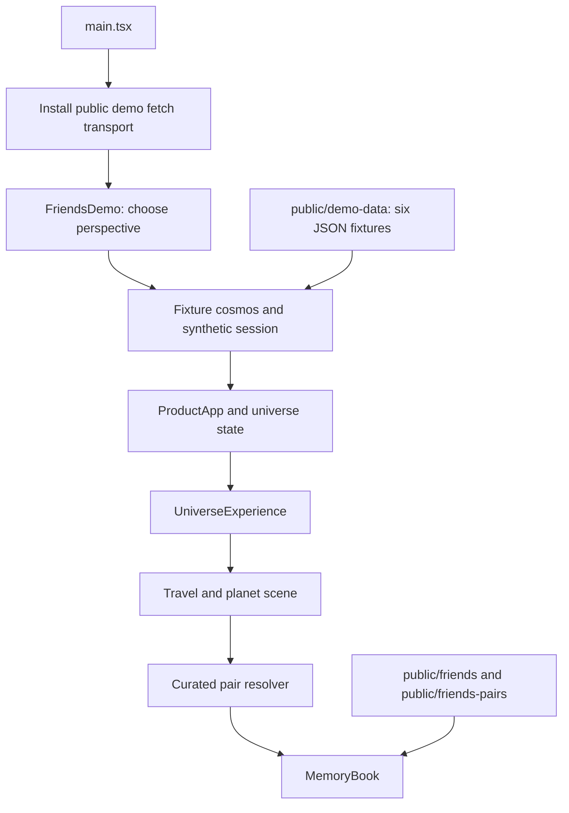
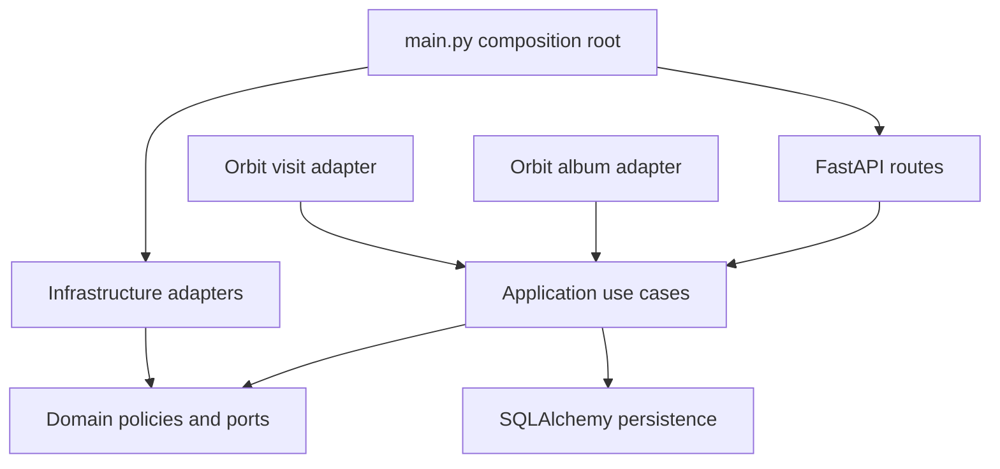

# Architecture

Orbit contains two execution paths: a hosted static demonstration and a Python service for the broader memory-universe prototype. The public entry currently selects the static path unconditionally.

## Public runtime

[`src/main.tsx`](../src/main.tsx) installs [`publicDemoTransport.ts`](../src/demo/publicDemoTransport.ts) before rendering the app. Same-origin `/api/` fetches are intercepted. Supported calls return fixture data; other API calls receive a prepared-demo response. The six fixture tokens are explicit fictional identifiers, not production credentials.

[`FriendsDemo.tsx`](../src/FriendsDemo.tsx) chooses the perspective. [`ProductApp.tsx`](../src/product/ProductApp.tsx) coordinates application phases and state hydration. [`UniverseExperience.tsx`](../src/modules/universe/UniverseExperience.tsx) connects the universe scene to a selected relationship and its book. [`friendsStories.ts`](../src/demo/friendsStories.ts) supplies curated Friends stories. Generic confirmed memories use [`convertMemoryToPages.ts`](../src/modules/memory-book/convertMemoryToPages.ts).

The frontend is React and TypeScript, bundled with Vite. Three.js and React Three Fiber render the scene; Drei and postprocessing provide scene helpers and effects. Zustand manages state. The book has dedicated page content, media, controls, and animation components.

## Backend runtime

The inherited service separates HTTP adaptation, application use cases, deterministic domain rules, and infrastructure adapters. [`backend/app/main.py`](../backend/app/main.py) composes the service and registers the Orbit routers. Application and domain files remain in their existing locations to preserve imports and project history.

The album adapter turns model-produced chapters into existing profile, relationship, nebula, planet, and memory records. It does not introduce a disconnected second rendering engine. Each confirmed chapter becomes a navigable planet with photo-backed memories. The model determines the grouping and proposed archetype; application code validates and persists the result.

The visit adapter tracks a shared destination, book page, revision, and participants. Tests cover separate guest tokens, read-only restrictions on unrelated mutations, cross-room token rejection, presence expiry, and room expiry. The `VisitTogether` component is present but is not mounted in the current public entry. This is backend capability, not a claim that the hosted site supports live shared sessions.

## From relationships to visual geometry

The inherited scoring and layout code translates normalized values into size, distance, and coordinates. In [`domain/scoring.py`](../backend/app/domain/scoring.py), a normalized score drives bounded display values. For example, visual radius uses `0.75 + 1.35 × sqrt(score / 100)`. Relationship rest length respects the two planet radii plus a collision margin and changes nonlinearly with normalized strength.

These formulas are visual policies. They are not scientifically validated measurements of friendship quality or emotional intimacy. The prepared demo consumes precomputed fixture values; merely opening the site does not recompute social meaning with a model.

## Media paths and hosting

The custom domain serves the app from `/`. Some existing photo, video, and GLB references retain `/orbit-friends-universe/` in their URLs. [`vite.config.ts`](../vite.config.ts) therefore keeps the root app base and copies public assets to the legacy prefix after a production build. This maintains compatibility at the cost of duplicated output assets.

The deployment workflow builds `dist` and publishes it through GitHub Pages. Python, local SQLite databases, server uploads, and model credentials are not shipped in that artifact. Pages settings associate the custom domain and enforce HTTPS.

## Design tradeoffs

Static fixtures give the demo predictable availability, but cannot demonstrate fresh album analysis. Curated fictional relationships make the navigation legible, but are not an evaluation dataset. Adapting the existing graph pipeline reduces duplicate machinery, but leaves inherited services and scripts beyond the demo's scope. The compatibility copy preserves current asset URLs, but a later cleanup should centralize URL construction before removing it.

See [Repository map](REPOSITORY_MAP.md) for file locations and [Limitations](LIMITATIONS.md) for completion criteria.
